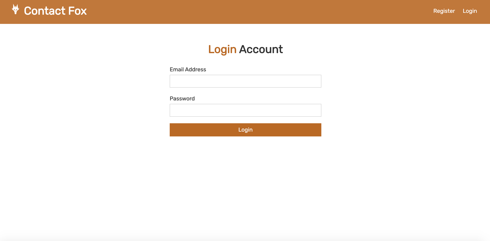
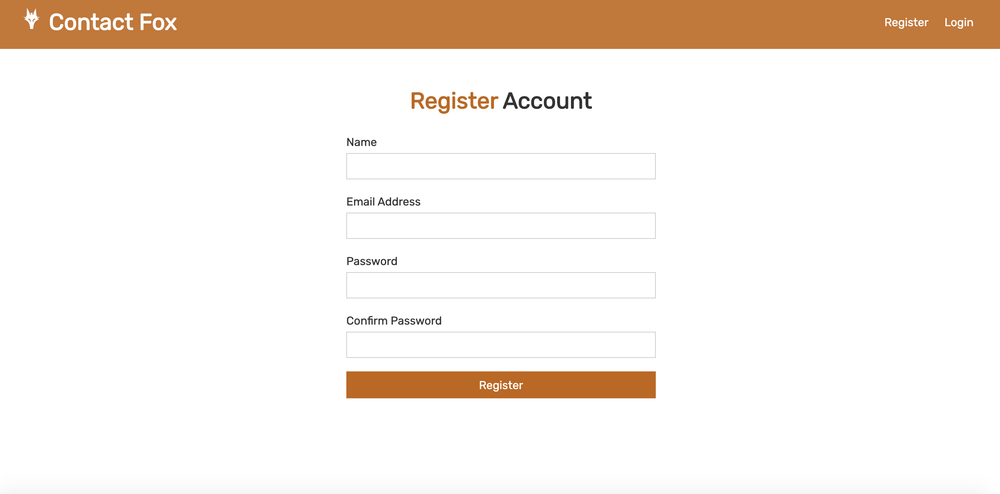
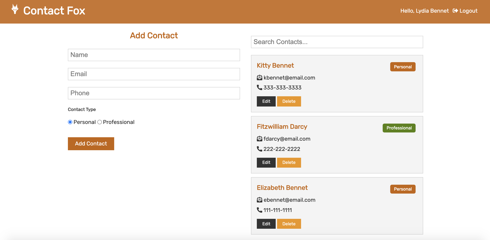

# Contact Fox

[](https://opensource.org/licenses/MIT)

## Table of Contents

- [Description](#description)
- [User Story](#user-story)
- [Features of the Application](#features-of-the-application)
- [Preview of Contact Fox](#preview-of-contact-fox)
- [Links](#links)
- [Installation](#installation)
- [Usage](#usage)
- [Built Using](#built-using)
- [License](#license)
- [Contributing](#contributing)
- [Questions](#questions)

## Description

Contact Fox is a contact manager application that enables users to easily store and find contact information, such as names, email addresses, and phone numbers. In order to access the application, the user must first create an account. With access to an account, the user is able sign in to view their existing contacts, add a new contact, delete, edit and update any existing contacts.

Contact Fox is a full stack MERN application that utilizes the Context API along with the useContext and useReducer hooks for state management. The application also uses private routes and JWT authentication to authorize individual users, so that they can safely register, sign in, and log out of the application.

## User Story

```
AS A user
I WANT to store and manage my contacts
SO THAT I can easily access information about my personal and professional connections.
```

## Features of the Application

```
GIVEN a contact management application
WHEN I register an account
THEN I am given private access to the application.

WHEN I log into the account
THEN I am presented with the dashboard where I can access my contacts.

WHEN I fill out the form and click on the Add Contact button,
THEN I will have stored a new contact.

WHEN I click on the Delete button of a saved contact,
THEN I will have deleted that contact permanently from my stored  contacts.

WHEN I click on the Edit button of a saved contact,
THEN I will be able to edit and update that contact's information.

WHEN I input characters into the Search Contacts field,
THEN I can filter through the contacts based on those characters.

WHEN I click on the Logout button on the navbar,
THEN I will be logged out of the application and be redirected to the login page.
```

## Preview of Contact Fox







## Links

- [Deployed Application](https://contact-fox.herokuapp.com)

- [Github Repository](https://github.com/rh9891/ContactFox)

## Installation

The application requires the following dependencies and/or package managers:

```
$ npm install axios bcryptjs concurrently config express express-validator jsonwebtoken mongoose nodemon react react-icons react-router-dom
```

When downloaded, the application requires the input of `npm install` into the command line interface in order to download the contents of the `package.json`.

## Usage

The application can be initiated by inputting `npm run dev` into the command line interface and running the application on `localhost: 3000`.

## Built Using

Listed below are the frameworks, libraries, and guides that made building this application possible:

- [Context](https://reactjs.org/docs/context.html)
- [Express.js](https://expressjs.com/)
- [Bcrypt.js](https://github.com/kelektiv/node.bcrypt.js#readme)
- [JSON Web Tokens](https://jwt.io/introduction)
- [Mongoose](https://mongoosejs.com/)
- [Node.js](https://nodejs.org/en/docs/)
- [Nodemon](https://www.npmjs.com/package/nodemon)
- [React](https://reactjs.org/docs/getting-started.html)
- [React Hooks](https://reactjs.org/docs/hooks-intro.html)
- [React Icons](https://react-icons.github.io/react-icons)
- [Traversy Media Tutorials](https://www.traversymedia.com)

## License

The MIT License (MIT)

Copyright (c) 2020 Romie Hecdivert

Permission is hereby granted, free of charge, to any person obtaining a copy of this software and associated documentation files (the "Software"), to deal in the Software without restriction, including without limitation the rights to use, copy, modify, merge, publish, distribute, sublicense, and/or sell copies of the Software, and to permit persons to whom the Software is furnished to do so, subject to the following conditions:

The above copyright notice and this permission notice shall be included in all copies or substantial portions of the Software.

THE SOFTWARE IS PROVIDED "AS IS", WITHOUT WARRANTY OF ANY KIND, EXPRESS OR IMPLIED, INCLUDING BUT NOT LIMITED TO THE WARRANTIES OF MERCHANTABILITY, FITNESS FOR A PARTICULAR PURPOSE AND NONINFRINGEMENT. IN NO EVENT SHALL THE AUTHORS OR COPYRIGHT HOLDERS BE LIABLE FOR ANY CLAIM, DAMAGES OR OTHER LIABILITY, WHETHER IN AN ACTION OF CONTRACT, TORT OR OTHERWISE, ARISING FROM, OUT OF OR IN CONNECTION WITH THE SOFTWARE OR THE USE OR OTHER DEALINGS IN THE SOFTWARE.

## Contributing

If you would like to contribute to this repository, please contact me via [Github](https://github.com/rh9891).

## Questions

If you have any questions, comments, or issues regarding this application, please do not hesitate to contact me via [Github](https://github.com/rh9891).
